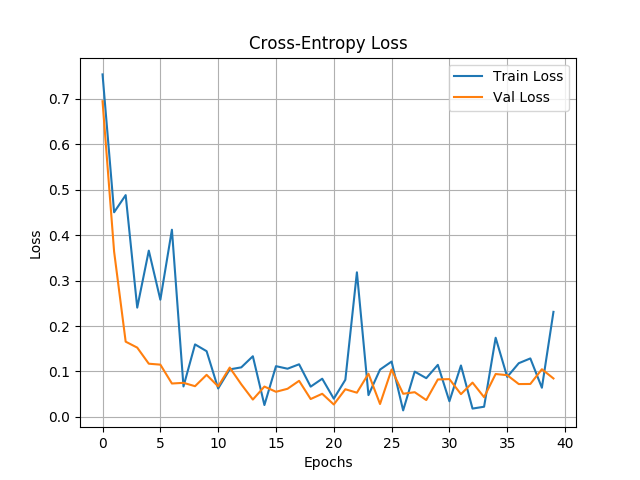
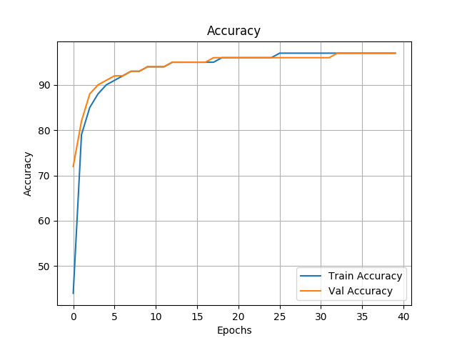
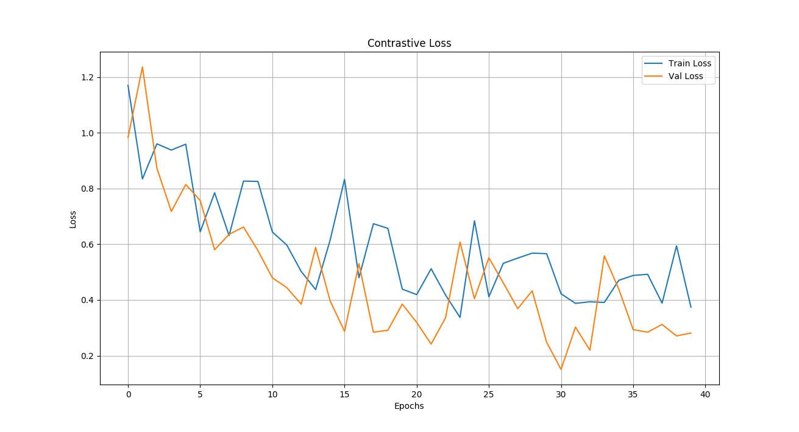

# Siamese-CNN-MNIST
Digit classification using Siamese CNN.

## Theory:  
Contrastive Loss is often used in image retrieval tasks to learn discriminative features for images. During training, an image pair is fed into the model with their ground truth relationship equals 1 if the two images are similar and 0 otherwise.  
The margin term is used to "tighten" the constraint: if two images in a pair are dissimilar, then their distance shoud be at least margin, or a loss will be incurred.  
Y = 1 if images are different else Y = 0 if the images belong to the same class.  

## Results:

Results for Classification Model:  

  

  

Results for Siamese Model:  

  

Few images showing similarity score:  

## References: 
* https://hackernoon.com/facial-similarity-with-siamese-networks-in-pytorch-9642aa9db2f7  
* https://github.com/harveyslash/Facial-Similarity-with-Siamese-Networks-in-Pytorch
* https://jdhao.github.io/2017/03/13/some_loss_and_explanations/
  

